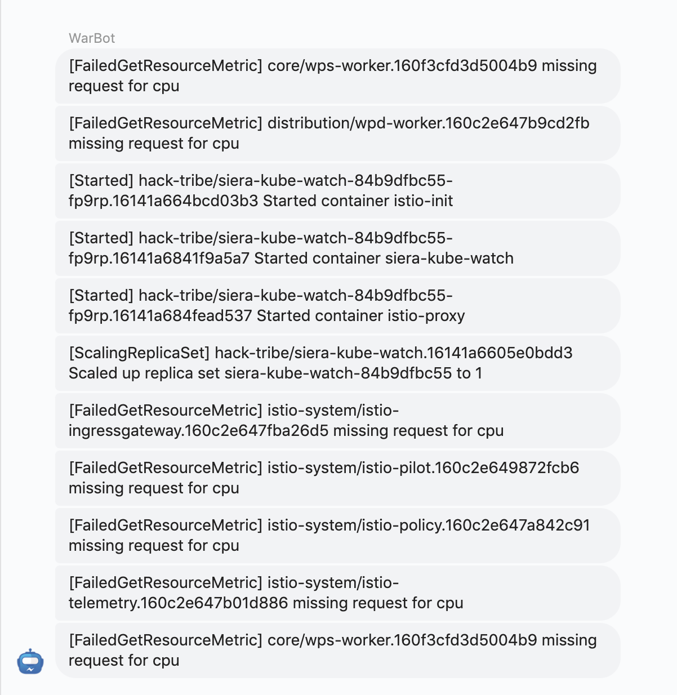
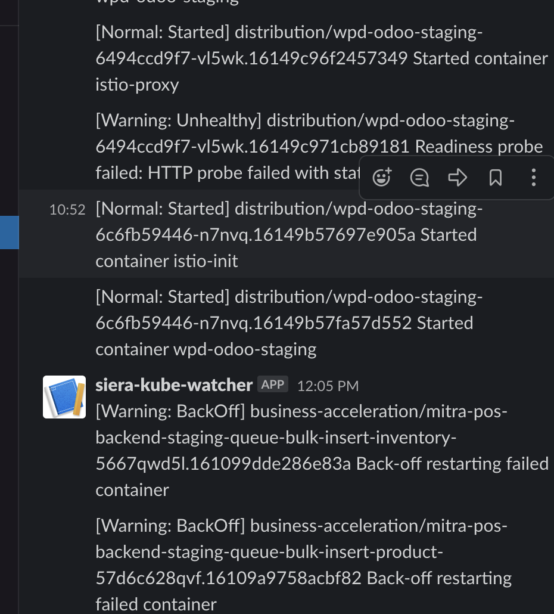
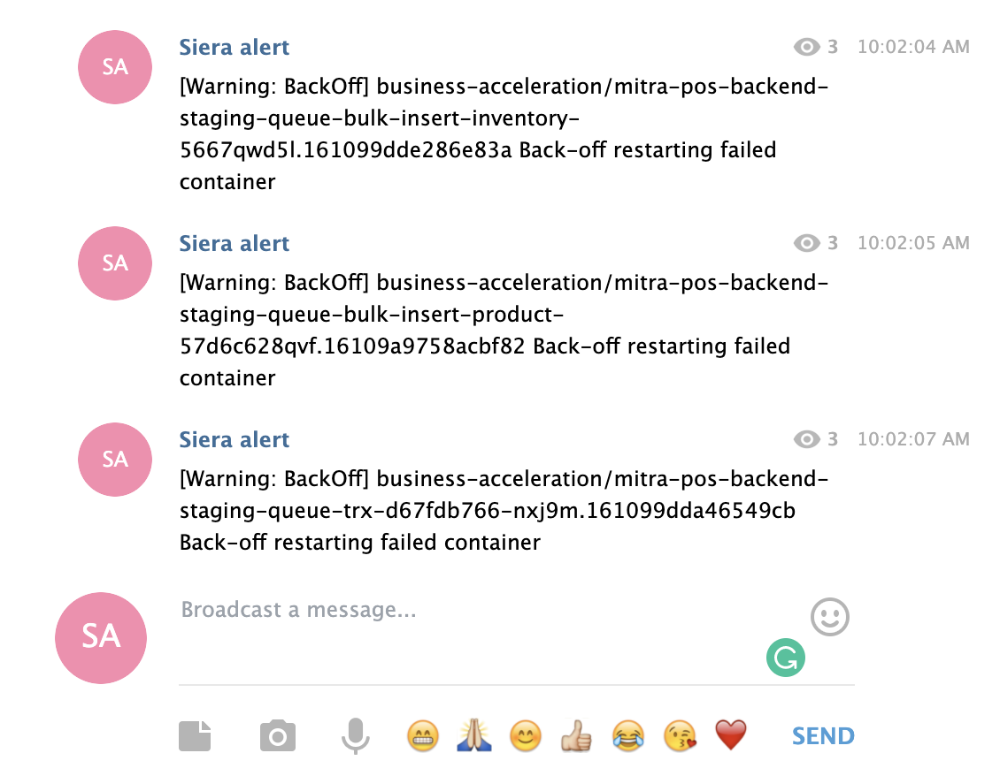

# siera-kube-watch
**siera kubewatch** is a Kubernetes events watcher that aims to publish incident (unexpected event) as a notification through webhooks.

Supported webhooks:
- slack
- telegram
- workplace chat
- webhook

It also supports liveness check (dead man's switch) functionality for alerting on availability of alerting pipeline.
```
livenesscheck:
  enabled: true
  interval: "1m"
```

# Build and Run

## Install Dependencies
```
$ go mod download
```

## Build
```
$ go build
```

## Run
```
$ ./siera-kube-watch
```

# Configuration
Copy the `config.example.yaml` as `config.yaml` and setup your own configuration as needed. 

# Helm

We provide a helm chart for easy installation https://github.com/warungpintar/charts/tree/master/warpin/siera-kube-watch

## Result workplace chat


## Result slack


## Result telegram


docker image size  35.2MB